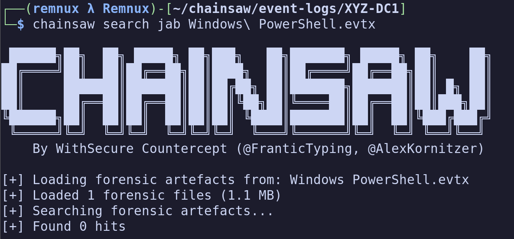

Before reading this blog post, I highly recommend viewing the a blog written by my coworker titled
[Grab Your Chainsaw, We're Going Hunting](https://medium.com/@izzyboop/grab-your-chainsaw-were-going-hunting-50a5c82cef5d).
Izzy originally taught me Chainsaw, and I think her blog does a fantastic job at giving an at-a-glance
tutorial for how to use Chainsaw.

The scope of this blog, instead, is going to be focusing on some of the less documented functions
of Chainsaw, from writing rules, to manipulating the Tau query syntax, to some real world examples
of utilizing Chainsaw at-scale to threat hunt and detect evil.

## Chainsaw Introduction


I'll keep this short-- [Chainsaw](https://github.com/WithSecureLabs/chainsaw) is an event log parser, among other things. It is designed by
WithSecureLabs, and meant to offer incident responders, forensics analysts, and security operations
analysts a way to rapidly query, parse, and classify artifacts related to a security event.

While Chainsaw has functionality beyond the Windows Event Log parsing, our focus will be largely on
event log parsing within the scope of this blog post.

## Your First Query

Before writing your first query, I'd recommend ensuring Chainsaw is on your PATH. Whether you're on
Windows, Linux, or MacOS, this is going to make Chainsaw much less tedious. Example commands in this
blog post will refer to the 'on-path' Chainsaw. It is vital to understand this is not a default
configuration, and will require a minor amount of additional effort that is beyond the scope of this
blog post.

### Chainsaw Search

Chainsaw has two 'types' of queries, search and hunt. We'll discuss Search first because it's quite
straightforward until we get into the Tau syntax and query chaining. In its most simple form, a
Chainsaw query might look like this:

```bash
┌──(remnux λ Remnux)-[~/chainsaw/event-logs/XYZ-DC1]
└─$ chainsaw search JAB Windows-PowerShell.evtx
```

And what does this return to us?

```plaintext
---
Event:
  EventData:
    Binary: null
    Data:
    - Stopped
    - Available
    - "\tNewEngineState=Stopped\r\n\tPreviousEngineState=Available\r\n\r\n\tSequenceNumber=15\r\n\r\n\tHostName=ConsoleHost\r\n\tHostVersion=5.1.20348.2110\r\n\tHostId=ea4c6695-b4d6-44d0-aa87-a48c656684c7\r\n\tHostApplication=powershell.exe -NoP -NoL -sta -NonI -W Hidden -Exec Bypass -Enc JABQAHIAbwBnAHIAZQBzAHMAUAByAGUAZgBlAHIAZQBuAGMAZQA9ACIAUwBpAGwAZQBuAHQAbAB5AEMAbwBuAHQAaQBuAHUAZQAiADsAdwBoAG8AYQBtAGkA\r\n\tEngineVersion=5.1.20348.2110\r\n\tRunspaceId=78548a5e-76dc-40af-9cb1-cf200129bfc3\r\n\tPipelineId=\r\n\tCommandName=\r\n\tCommandType=\r\n\tScriptName=\r\n\tCommandPath=\r\n\tCommandLine="
  System:
    Channel: Windows PowerShell
    Computer: DC-1.xyz.com
    Correlation: null
    EventID: 403
    EventID_attributes:
      Qualifiers: 0
    EventRecordID: 265
    Execution_attributes:
      ProcessID: 0
      ThreadID: 0
    Keywords: '0x80000000000000'
    Level: 4
    Opcode: 0
    Provider_attributes:
      Name: PowerShell
    Security: null
    Task: 4
    TimeCreated_attributes:
      SystemTime: 2024-06-12T00:50:32.433828Z
    Version: 0
Event_attributes:
  xmlns: http://schemas.microsoft.com/win/2004/08/events/event
```

Huh, that's kinda' wild. (I'll save those curious on what this might be doing, this is a `whoami`).
In it's most basic form, this is the easiest way to use Chainsaw, and can be quite deadly on its own.
However, this is quite fragile. For instance, what if we searched for `jab` instead?


Huh, that's kind of a problem, right? Often, when we're hunting for evil, we won't know the exact
casing of a given command. That's where the `-i` switch enters the picture.

```bash
┌──(remnux λ Remnux)-[~/chainsaw/event-logs/XYZ-DC1]
└─$ chainsaw search -i JAB Windows-PowerShell.evtx
```

And we're going to get the same results. That was quite a long output, so I'm not going to re-paste
this every time.

We have one more 'query parameter' to talk about here before we start to talk about drilling down on
some more nuanced usage. This is the `-e` switch, which is shorthand for 'regular **e**xpression.

Explaining regular expressions is probably out of the scope of this blog post as well, but suppose
for a moment that I wanted to detect any IP addresses mentioned in event logs, and return those
records for local inspection?

```bash
┌──(remnux λ Remnux)-[~/chainsaw/event-logs/XYZ-DC1]
└─$ chainsaw search -e "(25[0-5]|2[0-4][0-9]|[01]?[0-9][0-9]?)\.(25[0-5]|2[0-4][0-9]|[01]?[0-9][0-9]?)\.(25[0-5]|2[0-4][0-9]|[01]?[0-9][0-9]?)\.(25[0-5]|2[0-4][0-9]|[01]?[0-9][0-9]?)" Security.evtx
```

As anticipated, we're going to get records that mention *any* IPv4 address within the (Security) event
logs in this context.

### Refining Searches - Timestamps

When examining event logs, especially in a real world context, you're often going to get events that
do not obey your scope of interest. While it can be useful to baseline a system, often it's a bit
wasteful to start your search utilizing data that was outside the event's timeframe.

We have a few ways to deal with this, and their usage can be a bit confusing, so let's discuss...

The `--timestamp` switch is only particularly relevant in the context of the `search` mode for
Chainsaw, and is used to define a field with which to filter timestamps on. For clarity, there can
be multiple timestamp fields within Windows Event Logs (often in the case of webservers) and we may
want to filter based on a specific parameter.

However, this will often be used in the following context:
`--timestamp Event.System.TimeCreated_attributes.SystemTime` That's a little heavy so let's take a
moment to discuss what this actually does.

Chainsaw references key/value pairs. When we pass this into Chainsaw, we're saying:
"Please give me the contents of the `SystemTime` key, which belongs to the `TimeCreated_attributes`
key, which belongs to the `System` key, which belongs to the `Event` key. If you're familiar with
object oriented programming, you can think of these as properties of each other.

This will be highly useful later, but it's fairly important to understand how to drill down on
key-value pairs in Chainsaw. Take some time to look at the data if this doesn't make sense; form
opinions on what you're seeing-- run the above unfiltered search commands, and find how these fields
are displayed to you.

Now that we've established a field to filter our timestamps on, we can discuss both the from and to
switches. `--from` defines a 'start' for timestamps, and `--to` defines an 'end' for timestamps.
Windows Event Logs are in UTC, but Chainsaw exposes some ways to change this behavior. I do not
recommend utilizing this behavior, however, as forgetting to specify a timezone in later queries
can lead to incorrect conclusions.

Now, we know the switches, but what *format* is this anticipating? Timestamps can be specified by
the following syntax: `YYYY-MM-DDTHH:mm:ss`. That can be a little ambiguous, so let's actually type
some examples:

- 2024-12-31T23:59:59
  - This is a valid timestamp for "2024 December 31 at 11:59:59 PM" Note the use of 24 hour time.
- 1999-01-01T00:00:01
  - This is a valid timestamp for "1999 January 1 at 12:00:01 AM" In other words, a second after midnight.

## Advanced Applications of Chainsaw

Moving on from simple string matching, Chainsaw features a robust engine based on 'Tau', which I'll
explain later. For now, it's enough to understand that we're building towards a robust query language
that will let us have virtually unlimited control over which event logs we return, and we can do this
both from the command line, and with Chainsaw Rules.

### Refining Searches - Tau For Dummies

Anyone looking at this might realize a problem-- we have a way to string match, but we don't
really have a way to describe an event log entry directly. For instance, consider the following:

```bash
┌──(remnux λ Remnux)-[~/chainsaw/event-logs/XYZ-DC1]
└─$ chainsaw search 4624 Security.evtx
```

This is problematic for a few reasons. We *might* be looking for Event ID 4624 here. However, what
we get back isn't necessarily *just* 4624 event logs. Instead, we will receive any event log which
contains the string 4624. Not ideal. Let's fix that!

Remember how we discussed the key-value relationship of event logs previously? We will now apply that
knowledge to our queries. Referring to my previous query, I may actually be looking for event ID
4624, which is a successful login.

Refer to our previous Chainsaw output for some syntax clues, but maybe we want to drill down on the
`Event.System.EventID` parameter. Well, we can do that with Tau. Tau takes an 'expression' and will
use that expression to evaluate documents. Anything that matches the expression will be returned.

Tau expressions can be quite interesting (and maybe lack some documentation) but they can also be
very powerful in drilling down on event logs.

```bash
┌──(remnux λ Remnux)-[~/chainsaw/event-logs/XYZ-DC1]
└─$ chainsaw search -t 'Event.System.EventID: =4624'
```

When we specify a Tau statement, we need to quote it. This expression is evaluated using standard
boolean logic, which means that the following queries are also valid:

- Event.System.EventID: >4624
  - Return anything with an EventID greater than 4624.
- Event.System.EventID: !=4624
  - Return anything that *isn't* Event ID 4624.

Now, this one stumped me for awhile, what if we want to query a *string value*. Say I have a bad guy
and I want to see any time they logged in via 4624. Now, I *could* search for their name using
simple string searching, but we can be more specific than this.

Consider the following query:

```bash
┌──(remnux λ Remnux)-[~/chainsaw/event-logs/XYZ-DC1]
└─$ chainsaw search -t 'Event.EventData.TargetUserName: Administrator'
```

This would return *any* documents where Administrator is specified in the TargetUserName field.
That's problematic, but we'll talk about that in the next section. Instead, I want to highlight
one more behavior of the string engine in Tau.

Perhaps I have a series of admin accounts that I believe may be compromised. How would I search for
anyone with admin in their name?

```bash
┌──(remnux λ Remnux)-[~/chainsaw/event-logs/XYZ-DC1]
└─$ chainsaw search -t 'Event.EventData.TargetUserName: *Admin*'
```

The above query uses `*` to *wildcard* any beginning or ending characters, and is quite fast. Again,
there are multiple ways to do this, but it's handy for us to use wildcards here as opposed
to regular expression to have ultimate control over which fields we're matching on.

And a final behavior to consider, what if I didn't know the capitalization that I will be searching
for?

```bash
┌──(remnux λ Remnux)-[~/chainsaw/event-logs/XYZ-DC1]
└─$ chainsaw search -t 'Event.EventData.TargetUserName: i*admin*'
```

The `i` prefix in this string engine will cause this search to be case insensitive.

It's important to understand these concepts, because they will be applied later in the rules section
where we'll write YAML-based rules that mimic this Tau syntax.

### Chaining Queries

Now that we've spelled out how to utilize Tau parameters, we can actually start to construct more
advanced queries. Suppose I wanted to detect users who logged in with accounts such as 'admin' and
'administrator', using a network login.

To drill down on this, let's define the problem:

- We're looking for successful login events (Event ID 4624)
- We want a specific user name parameter.
- And we want to see logins of type 3.

We can define this with three different Tau queries:

```bash
-t 'Event.System.EventID: =4624'
-t 'Event.EventData.LogonType: =3'
-t 'Event.EventData.TargetUserName: i*admin*'
```

If any of these are unintuitive to you, do the following: Take the first query, run it. Now, identify
where I obtained the LogonType parameter and TargetUserName parameters from, and then craft those
queries independently.

This is 'drilling down' on logs, and is a common analyst process. You identify a broad behavior, then
begin to specify queries to limit your output to certain behaviors.

So if we wanted to combine these queries, how would we go about it? Well, by default, you can specify
multiple parameters with no issues and they are `AND`ed by default. So if we wanted to solve our problem,
we might do the following...

```bash
┌──(remnux λ Remnux)-[~/chainsaw/event-logs/XYZ-DC1]
└─$ chainsaw search -t 'Event.System.EventID: =4624' -t 'Event.EventData.TargetUserName: i*admin*' -t 'Event.EventData.LogonType: =3'
```

This functionality is *incredibly* potent at rapidly cutting through event logs, and can allow you
to essentially build out a custom query to pull out virtually any sort of evil from the event logs
simply by searching. We can apply this to IP addresses...

```bash
┌──(remnux λ Remnux)-[~/chainsaw/event-logs/XYZ-DC1]
└─$ chainsaw search -t 'Event.System.EventID: =4624' -t 'Event.EventData.IpAddress: 192.168.65.131'
```

Note that I said Chainsaw, by default, will `AND` these parameters. What if we wanted to specify
an `OR`? While this is quite limited in usefulness, we might consider passing the `--match-any` switch,
which will instead change the default behavior of all of these queries to `OR`. So in the case
of the above query, we will match any records that have an EventID of 4624 OR any records that have
an IP address of 192.168.65.131. Handy, but queries must be crafted carefully since you cannot control
which expressions are `AND`ed and which expressions are `OR`'d.

### Putting It All Together

Now we have all the components necessary to construct advanced Chainsaw queries directly from the
command line. Perhaps we believe a threat actor utilizing usernames similar to 'hacker' is logging
in via network login from IP address 192.168.65.131. We know that the incident took place on April 1
2024 between the hours of 8PM and 10PM UTC. Take a moment to consider how to craft this query
before looking at the answer...

```bash
┌──(remnux λ Remnux)-[~/chainsaw/event-logs/XYZ-DC1]
└─$ chainsaw search -t 'Event.System.EventID: =4624' \
-t 'Event.EventData.TargetUserName: i*hacker*' \
-t 'Event.EventData.LogonType: =3' \
--timestamp Event.System.TimeCreated_attributes.SystemTime \
--from 2024-04-01T20:00:00 \
--to 2024-04-01T22:00:00
```

While that's quite long, we can now detect *any* network logins that took place during that time
from a user that may have matched that username. We can start to add/subtract information as necessary
to refine our query. Consider that we may be dealing with multiple event logs from multiple systems?
Can you think of how this might help us recognize lateral movement across multiple systems?

Hopefully the usefulness of that information is becoming readily apparent.

## Conclusion

This is first part of a three-part series, to keep this from becoming... too painfully long. However,
I would recommend spending some time getting familiar with the more advanced query behaviors
I've discussed here, as they'll be highly applicable to writing chainsaw rules in the future during
the Chainsaw Hunt mode, where we can specify either SIGMA rules (and mappings) or rule files, which
are essentially just YAML Tau queries, with the added benefit of having ultimate control over the
boolean logic of matches, and the ability to aggregate results based on various fields returned.
