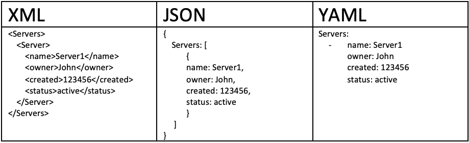
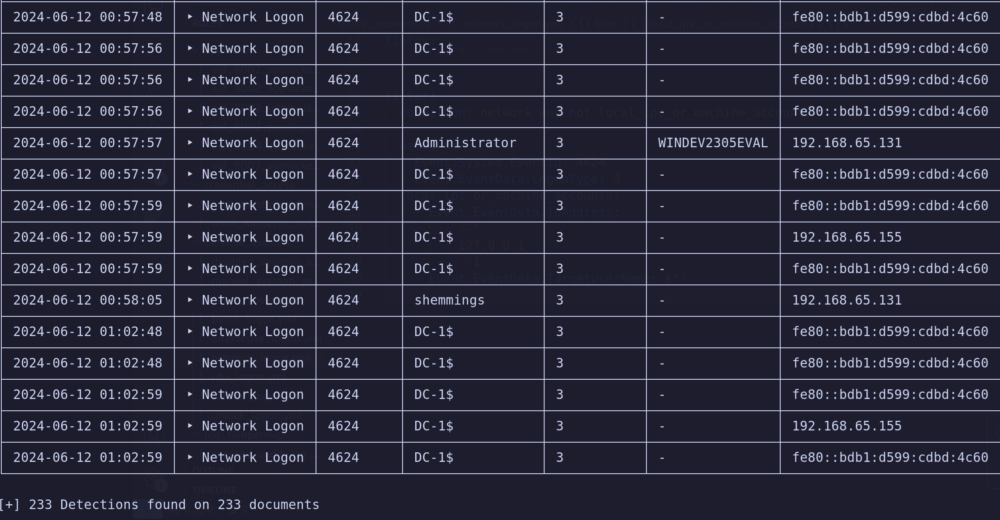
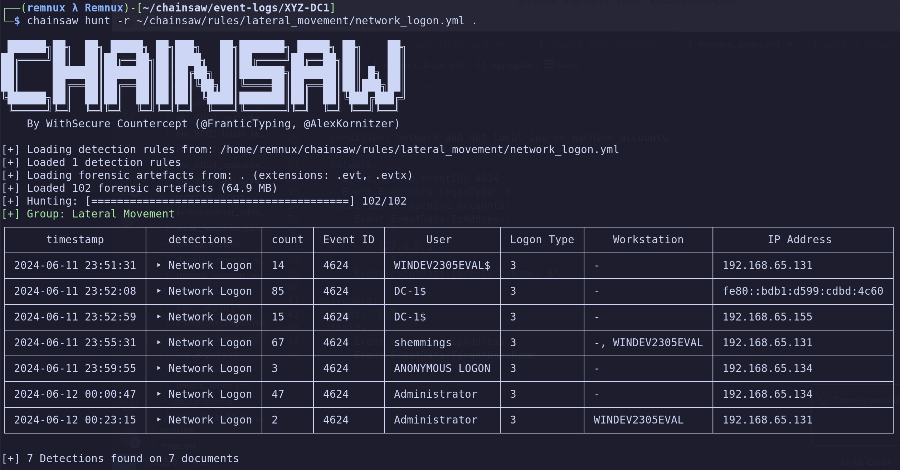
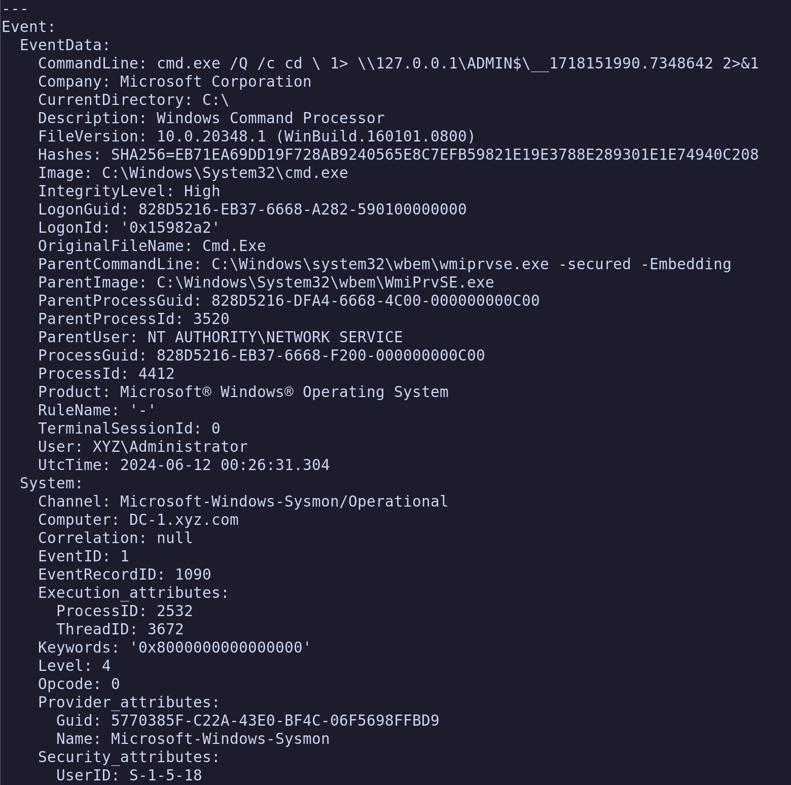
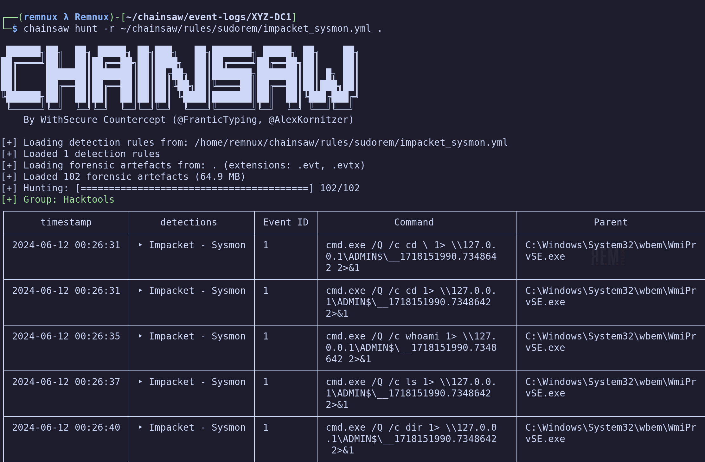
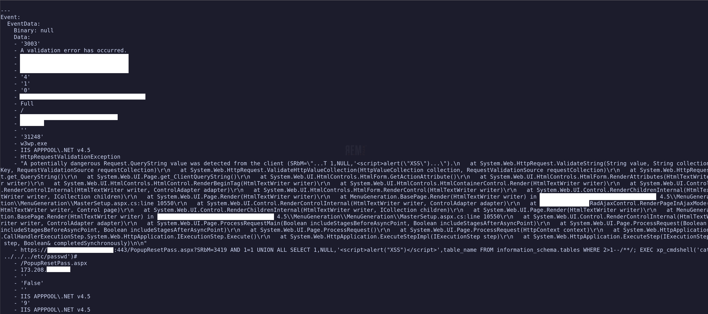
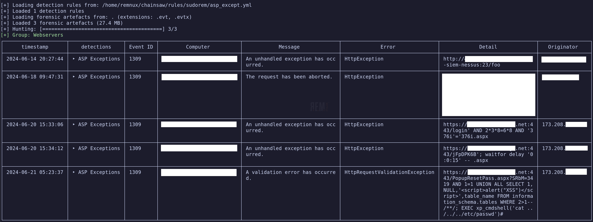

This is part two of my blog discussing some of the more nuanced usage of WithSecure's forensic
artifact parsing tool, Chainsaw. If you haven't read part 1, you can do so by clicking on the link
[here.](https://sudorem.dev/posts/advanced-chainsaw-1/)

The scope of this post will be largely limited to Chainsaw Rules, as I believe Sigma is well
documented at this point. We'll do this using a 'crawl, walk and run' approach.

- First, we'll modify an existing rule network connection login rule to aggregate the results and
give us a summary of the logins observed.
- Second, we'll write our own rule detecting basic Impacket utilization that isn't by-default
present in the Chainsaw ruleset.
- And third, we'll write a rule that uses a less obvious feature in Chainsaw's handling of the Tau
ruleset to destructure arrays in ASP.NET logs.

## Chainsaw Rules Explained

Chainsaw rules are YAML documents that essentially act as reusable Tau queries. Recall that Tau is
Chainsaw's documentation tagging syntax,and takes advantage of a key-value relationship. To refresh
ourselves further, we might look at a simple Tau query: `Event.System.EventID: =4624` This looks in
the Event key, which contains the System key, which contains the EventID key, and 'tag' documents
that match our expression. In this case, that expression is checking for equality to 4624. This
simple Tau query checks for Event ID 4624, which is commonly associated with account logins.



YAML takes advantage of this syntax as well. We have keys and values in much the same manner that we
do in the Tau query language. When we look at a Chainsaw rule, we can break this down into several
sections.

### Metadata

```yaml
---
title: Network Logon
group: Lateral Movement
description: An Network based logon
authors:
  - FranticTyping


kind: evtx
level: info
status: stable
timestamp: Event.System.TimeCreated
```

The metadata for Chainsaw is quite simple to understand, but I'll break this down quick.

**Title:** The *title* field does precisely what it prescribes, it titles the rule. In the Chainsaw
Hunt output, this will be the second column returned.

**Group:** Chainsaw will group output by default based on categorization. In this case, we are
grouping these network logins into the Lateral movement category. This simply controls how this
grouping occurs.

**Description:** The first of our 'non-visible' fields, descriptions exist to offer context to a
Chainsaw rule, and won't be printed out in the final output.

**Authors:** Authors simply allows you to indicate who to blame when things aren't working right. :)
This is actually our first experience assigning multiple multiple values to a single key, albeit not
a wildly useful one.

**Kind:** Kind controls the type of artifact that Chainsaw is being interacted with. In most cases,
and for the scope of this blog, this will always be 'evtx', but I believe Chainsaw rules can also
interface with various other artifacts in the Chainsaw parsing engine. The specific user facing
function relating to this field is through the `--kind` switch, where we could pass 'evtx' to gain
the same behavior. This is useful if you have rules that might cause duplicate data to display if
interacting with a large ruleset.

**Level:** This is a shockingly useful feature allowing you to delineate the 'level' of events, or
the severity. Chainsaw rules by default have 'critical', 'high', and 'info' defined severity levels.
This is interacted with by means of the `--level` switch, where we might also specify a level that
we want to display. For instance, if dealing with a large ruleset, I only want to see high confidence
detectors that indicate malice, I would pass in `--level critical` and only receive things that are
strongly indicative of malice.

**Status:** The last of the user-facing fields. If a rule is unstable or prone to creating confusion,
false positives, or other shortcomings, you might define an additional field here. When a user is
utilizing a ruleset, if they're only interested in detectors that are not currently being tested or
developed, they might pass the `--status stable` parameter at the CLI to quell any misbehaving rules.

**Timestamp:** Recall in our first blog, within the `search` syntax we had to define a timestamp to
interact with through `--timestamp Event.System.TimeCreated`. This timestamp field is simply a static
expression of this. This is highly useful; since this timestamp is already indexed, we can simply
define `--from` and `--to` at the command line, and Chainsaw will understand the timestamp we wish to
reference for each rule. Keep in mind this doesn't *have* to be the same for each rule; one rule can
identify an entirely seperate timestamp field, and Chainsaw will still limit the timeframe to the
appropriate window using timestamps defined in each rule.

### Fields

Chainsaw by default outputs items in a tabular fashion in the command line. However, we do need a
way to define the contents that comprise these tables. Enter the 'fields' section:

```yaml
fields:
  - name: Event ID
    to: Event.System.EventID
  - name: User
    to: Event.EventData.TargetUserName
  - name: Logon Type
    to: Event.EventData.LogonType
  - name: Workstation
    to: Event.EventData.WorkstationName
  - name: IP Address
    to: Event.EventData.IpAddress
```

Our second encounter with an array this time, and I can take some time to explain this now. The `-`
associated with the YAML syntax here defines an array of values. In this case, we're defining an
array (or a list) of values to associate with the 'fields' key. The nuance of this isn't highly
important, but we *will* use this later when conceptualizing the destructuring of arrays.

When we interact with the Fields output, we create a `name` which is simply a column header. Then we
map that to a value with the `to` key with a value of an event we wish to print to that table. In
the above example, we are first saying: "Create a column Event ID, and place the *value* of the
Event.System.EventID field into that column.

We can add as many fields as we wish, but keep in mind brevity for users that may be interacting with
Chainsaw from the command line. Terminal widths may cause interesting wrapping behaviors with columns.

### Filters

```yaml
filter:
  condition: network and not local_ips_or_machine_accounts

  network:
    Event.System.EventID: 4624
    Event.EventData.LogonType: 3
  local_ips_or_machine_accounts:
    - Event.EventData.IpAddress:
        - '-'
        - 127.0.0.1
        - ::1
    - Event.EventData.TargetUserName: $*'
```

Filters can be as simple or complicated as necessary. If you remember in our previous discussion, we
did not have flow over the boolean logic of our rules. However, in Chainsaw's rule syntax, we do.

The condition is a simple boolean conditional expression. In our example, our condition is thus:
`network and not local_ips_or_machine_accounts`. These reflect the attributes of a given key. So we
are actually saying 'if network is true, *and not* local_ips_or_machine_accounts' then please give
me the results.

That 'and not' can be a bit of a hangup, but is essentially a way for us to describe records that we
do *not* want to see. More on that later.

We then define two keys, `network` and `local_ips_or_machine_accounts`. This example was carefully
chosen to demonstrate two different behaviors here.

In `network` key, we define a further two keys. The `network` field will only evaluate to true if
the condition of *both* of these keys are true. This is quite simple at face value, but it's important
to understand that this is, by default, a boolean `AND`. This will be in contrast to our next key.

```yaml
  local_ips_or_machine_accounts:
    - Event.EventData.IpAddress:
        - '-'
        - 127.0.0.1
        - ::1
    - Event.EventData.TargetUserName: $*'
```

Note that we are, once again, interacting with arrays. The `Event.EventData.IpAddress` field contains
a few values as an array. These will, by default, be a boolean `OR`; or put another way, if the
content of *any* item in the array is satisfied, the condition will evaluate to true. It is also
worth noting that the `Event.EventData.IpAddress` key itself is a part of an array, extending this
logic to the keys themselves.

In this specific query, we are trying to exclude any machine-local IP addresses, or instances where
we might receive an IP address that indicates lateral movement may have occured from the local
host. (It did not, that would not be lateral movement.) However, remember we are using a `not`, or
logical negation in the condition statement, so we need this to be *true* when we want items to be
excluded.

If we refer back to the Tau discussion in the first blog post, we can glean some insight into what
the second portion of the `local_ips_or_machine_accounts` condition may be checking for. In this
case, we are using the wildcard character to say, in plain English, we only want this to be satisfied
as true when something starts with the `$` character. This specifically is an attempt to quell local
machine account logins, which can occasionally bubble up in 4624's for reasons I truly do not understand.

If you are having difficulties with rules, it is highly likely you defined something as an array and
it is not creating the query you intend to, or vice versa, something is not in an array that should be.

## Modifying Our First Rule

I find the following query highly useful at getting an at-a-glance summary of network logins that
took place during a period of interest in event logs. This will also introduce another field for
us to experiment with, and round off our Chainsaw knowledge.

### Scenario

Suppose we have compelling evidence to indicate that a threat actor has accessed the domain controller
of `XYZ`, our fictitious organization. We believe this threat actor may have been accessing the
domain controller through a tool called Impacket from their initial foothold.

We might ponder on the compromised account, or we may instead simply begin by checking which users
actually interacted with the host in our time frame. Now, by default, Chainsaw will be quite noisy
when interacting with domain controllers, especially with wide windows of interest.



To save our scroll wheels, we might want to **aggregate** the output, and instead count the amount
of *times* a user logged in during our interest window.

So let us utilize the default rule, and append some logic to the end in the form of an additional
section.

```yaml
---
title: Network Logon
group: Lateral Movement
description: An Network based logon
authors:
  - FranticTyping


kind: evtx
level: info
status: stable
timestamp: Event.System.TimeCreated


fields:
  - name: Event ID
    to: Event.System.EventID
  - name: User
    to: Event.EventData.TargetUserName
  - name: Logon Type
    to: Event.EventData.LogonType
  - name: Workstation
    to: Event.EventData.WorkstationName
  - name: IP Address
    to: Event.EventData.IpAddress


filter:
  condition: network and not local_ips_or_machine_accounts

  network:
    Event.System.EventID: 4624
    Event.EventData.LogonType: 3
  local_ips_or_machine_accounts:
    - Event.EventData.IpAddress:
        - '-'
        - 127.0.0.1
        - ::1
    - Event.EventData.TargetUserName: $*'
```

### Aggregation

Aggregate, as the name suggests, groups information in the tabular output by one or more fields.
When we 'aggregate' output, we introduce a new column, 'count', to the tabular output. This simply
tracks the number of occurences of that event in the window of interest.

We define aggregate as such:

```yaml
aggregate:
  count: '>1'
  fields:
    - Event.EventData.IpAddress
    - Event.EventData.TargetUserName
```

Aggregate takes two general arguments. We define a **count**, which is a numerical expression that is
evaluated, and only combined occurences of that event that satisfy the criteria will be aggregated.
In the above example, we have said `>1`, or scenarios where the count is greater than one. In other
words, if a single event has occured, please don't aggregate it, just print it directly.

The second parameter, **fields** are the columns to aggregate upon. In this scenario, we are saying
aggregate logins where the IpAddress and TargetUserName fields are the same. In other words, I want
to see a condensed version of logins from *unique IP address and unique account combinations*.

In practice, if we append this field to our query, it looks like this.



This is much more tolerable of an output. We can also now start to draw some conclusions here.
We have three IPv4 addresses, an IPv6 address, three accounts, and an anonymous login at play.

You may now start to muse on who our bad guy is; however our next section should make this abundantly
clear.

## The Impact of Impacket

We will now craft an entirely custom rule to track usage of Impacket, a common attacker toolset for
remote interaction of Windows based systems. This will utilize SysInternals' 'SysMon' Event tools,
without which this would be much more difficult depending on the configuration of the host system.

Impacket, in command line event logs, looks quite similar to the following:
`cmd.exe /Q /c cd \ 1> \\127.0.0.1\ADMIN$\__1718152772.6827192 2>&1`
This is the *default*, and not necessarily the only point of evil to detect on. However, we can craft
a rule that looks for these defaults, and attacker methodology often does not find attacks deviating
from the default configurations often.

We might start by looking for good detection opportunities. We might start with something like...
"I don't think most tools interact with shares like this, on the localhost." And you would be very
correct; many tools don't.

So we can say `\\127.0.0.1` is a little suspect. Furthermore, the hidden share (signified by the
trailing $) ADMIN is also not wildly observed in standandard user automation. So we might want to
detect `ADMIN$` in the command line. And finally, we may consider output redirection of stderr to stdout,
or `2>&1` to be a little strange, users on Windows do not often do this kind of activity.

With all that in mind, we have some decent opportunities to detect evil, so lets's get started.

### Our First Rule

We may begin by describing our general metadata. I'm just going to throw this up in the blog, and
we'll take it at face value.

```yaml
title: Impacket - Sysmon
group: Hacktools
description: Detects Impacket invocations using SysMon Logs
authors:
  - sudoREM


kind: evtx
level: critical
status: development
timestamp: Event.System.TimeCreated
```

Note here I've defined this as a critical event, but a status of in development. This is important;
this is not a full confidence detector (and in fact, it does not behave as it should, but will serve
well for our demonstration.)

Once we've got this established, we need to start looking for some decent places to detect on this
in the event log. And we've already established a good pattern of behavior when looking for malice
with our previous `search` mode. We can search for some of these strings in our event logs, and see
what comes out.

We might start with the following: `chainsaw search '\\127.0.0.1' .` and see what falls out of our
event logs.



That looks an awful lot like Impacket to me. So let's make some observations here. Where did we see
that this was likely Impacket? We can see it in the `Event.EventData.CommandLine` value.

What event log produced this? We can find that in the `Event.System.Channel` portion, this was
produced by `Microsoft-Windows-Sysmon/Operational`. And lastly, if we want to be efficient, which
event ID produced this? The `Event.System.EventID` lets us know that this was an Event ID of 1 from
the Sysmon logs.

With that in mind, we now have a solid green light to start carving out our `filters` field.
We know that we're going to have some boolean logic here. Let's start first with our event log filter.

We previously established the two keys of interest for this filter, `Channel` and `EventID` respectively.

So let's fetch those values and place them in an `event_log` field like so:

```yml
  event_log:
    Event.System.EventID: 1
    Event.System.Channel: Microsoft-Windows-Sysmon/Operational
```

Looks good to me, I'm only interested (for this rule) in event logs with an ID of 1 from Sysmon, so
this does precisely as it purports.

Likewise, we'll just spit out some generic fields that looked interesting in our previous query:

```yml
fields:
  - name: Event ID
    to: Event.System.EventID
  - name: Command
    to: Event.EventData.CommandLine
  - name: Parent
    to: Event.EventData.ParentImage
```

We might also consider adding in the user or host involved, but I haven't found that necessary thus
far; Impacket hasn't snuck up on me (yet.)

Now for the filter portion, this stumped me for a bit, but keys must be *unique* so to carve out
a series of `AND` statements, we'll need three seperate conditional checks against the command line
portion if we want a high confidence detector.

So if we define three more conditional fields, `local_share`, `hidden_share` and `command_redirection`
we can start to build out the next portion of our query.

```yaml
  local_share:
    Event.EventData.CommandLine: '*\\127.0.0.1*'
  
  hidden_share:
    Event.EventData.CommandLine: '*ADMIN$*'

  command_redirection:
    Event.EventData.CommandLine: '* 2>&1'
```

With the above, we're specifically looking to see if the `\\127.0.0.1` and `ADMIN$` fields appear
anywhere in the command line key, and we are specifically asking if this entire command block ends with
`2>&1` with our wildcarding. (Note the rule's addition of a space and the lack of ending wildcard.)

And lastly, we must define this in our `condition` key. Since we want anything that satisfies all
these conditions, we can simply chain all our statements together with ANDs.

`condition: event_log and local_share and hidden_share and command_redirection`

That reads quite like plain english as well, which is nice. So all together, our rule looks like this:

```yaml
---
title: Impacket - Sysmon
group: Hacktools
description: Detects Impacket invocations using SysMon Logs
authors:
  - sudoREM

kind: evtx
level: critical
status: stable
timestamp: Event.System.TimeCreated

fields:
  - name: Event ID
    to: Event.System.EventID
  - name: Command
    to: Event.EventData.CommandLine
  - name: Parent
    to: Event.EventData.ParentImage

filter:
  condition: event_log and local_share and hidden_share and command_redirection

  event_log:
    Event.System.EventID: 1
    Event.System.Channel: Microsoft-Windows-Sysmon/Operational

  local_share:
    Event.EventData.CommandLine: '*\\127.0.0.1*'

  hidden_share:
    Event.EventData.CommandLine: "*ADMIN$*"

  command_redirection:
    Event.EventData.CommandLine: "* 2>&1"
```

Now we can test this rule out and ensure it works as anticipated.



And it does, quite well. This detects a total of 53 Impacket-related events with no false positives
on the domain controller in question. Now that we have a decent grasp on writing rules and finding
actual evil, we can start to apply this in unique ways.

## ASP.NET and Arrays

I could spend a lot of time explaining this in verbose terms, but I think I can do this with some
bullet points instead, so let's try that approach now that we're more comfortable with Chainsaw.

- Chainsaw can index arrays.
- Arrays are indexed like so: `array[0]`
- Remember arrays start at zero. The above obtains the first item of an array.
- We're familiar with arrays already, the event log output of Chainsaw looks similar.

Hopefully that was a quick and digestable rundown for this last feature. With the above in mind,
if I want to take advantage of indexing arrays, I need do nothing more than identify a field
which is an array, and index it with the above syntax.

For this section we'll be hunting evil in ASP.NET logs. These appear as EventID 1309's in the Windows
Application logs. There are other events that also appear as EventID 1309, so it is important
that we also define a `provider_attribute` key, which you will see in a bit.

We can begin like we have in the past, with a simple search for EventID 1309.


### Parsing Arrays

Parsing arrays in Chainsaw is actually very simple. I'll avoid going over some of the details we have
previously. Feel free to look back and fill in the blanks for missing portions.

When we define the fields that we're interested in, we simply need to refer to the array's index.
So for instance in the `Event.EventData.Data` key above, we have an array extending from zero to...
a fairly high number. If we wanted to obtain the value `3003`, we would reference this by asking for
`Event.EventData.Data[0]`. Fairly straightforward. So when we craft our tabular output, we might
want to look at the following values:

```yaml
fields:
  - name: Event ID
    to: Event.System.EventID
  - name: Computer
    to: Event.System.Computer
  - name: Message
    to: Event.EventData.Data[1]
  - name: Error
    to: Event.EventData.Data[17]
  - name: Detail
    to: Event.EventData.Data[19]
  - name: Originator
    to: Event.EventData.Data[21]
```

The names of these columns give away the contents of these; there's references available on the
internet for this as well.

In this case, I've specified that I want the following:

- `Data[1]`: The 'message' pertaining to the error.
- `Data[17]`: The 'type' of error.
- `Data[19]`: The details of the error. This will give me the request parameters.
- `Data[21]`: The originator of this request; potentially our bad guy.

We also need to quell our output a bit from this; production servers can raise legitimate errors
that are not indicative of malice. Let's do this by defining an `uninteresting` key that we can add
to as output returns that is always uninteresting.

```yaml
filter:
  condition: event_information and not uninteresting
  event_information:
    Event.System.EventID: 1309
    Event.System.Provider_attributes.Name: "i*ASP.NET*"

  uninteresting:
    Event.EventData.Data[17]:
      - "NullReferenceException"
      - "ArgumentNullException"
```

This is fairly intuitive at this point, so I won't toil over this too much. Note that I wildcarded
the ASP.NET portion of the `Provider_attributes.name` key. This is because the version associated
with this value changes depending on the ASP.NET version running on the server.

Our final rule looks like this:

```yaml
---
title: ASP Exceptions
group: Webservers
description: ASP internal auditing errors and exceptions.
authors:
  - sudoREM

kind: evtx
level: high
status: stable
timestamp: Event.System.TimeCreated

fields:
  - name: Event ID
    to: Event.System.EventID
  - name: Computer
    to: Event.System.Computer
  - name: Message
    to: Event.EventData.Data[1]
  - name: Error
    to: Event.EventData.Data[17]
  - name: Detail
    to: Event.EventData.Data[19]
  - name: Originator
    to: Event.EventData.Data[21]

filter:
  condition: event_information and not uninteresting
  event_information:
    Event.System.EventID: 1309
    Event.System.Provider_attributes.Name: "i*ASP.NET*"

  uninteresting:
    Event.EventData.Data[17]:
      - "NullReferenceException"
      - "ArgumentNullException"
```

And if we run it, our output looks a bit like this.



As we can see, someone hit this webserver with Nessus at some point in the past, and someone else
was doing some SQL and XSS enumeration.

## Conclusion

We've now written a few rules, we might consider maintaining these in a repository somewhere, and
sharing them with other threat hunters, or within our organization to help standardize queries and
facilitate the sharing of knowledge and techniques.

We have discussed the basic fields, the wildcard characters, and even some more advanced techniques
such as aggregation and Chainsaw's array indexing.

In the next and final portion of the series, we'll weaponize some default and custom rules to
hunt for compromise utilizing redacted real-world cases to demonstrate just how far we can push
Chainsaw for rapid forensic analysis of Windows artifacts.
