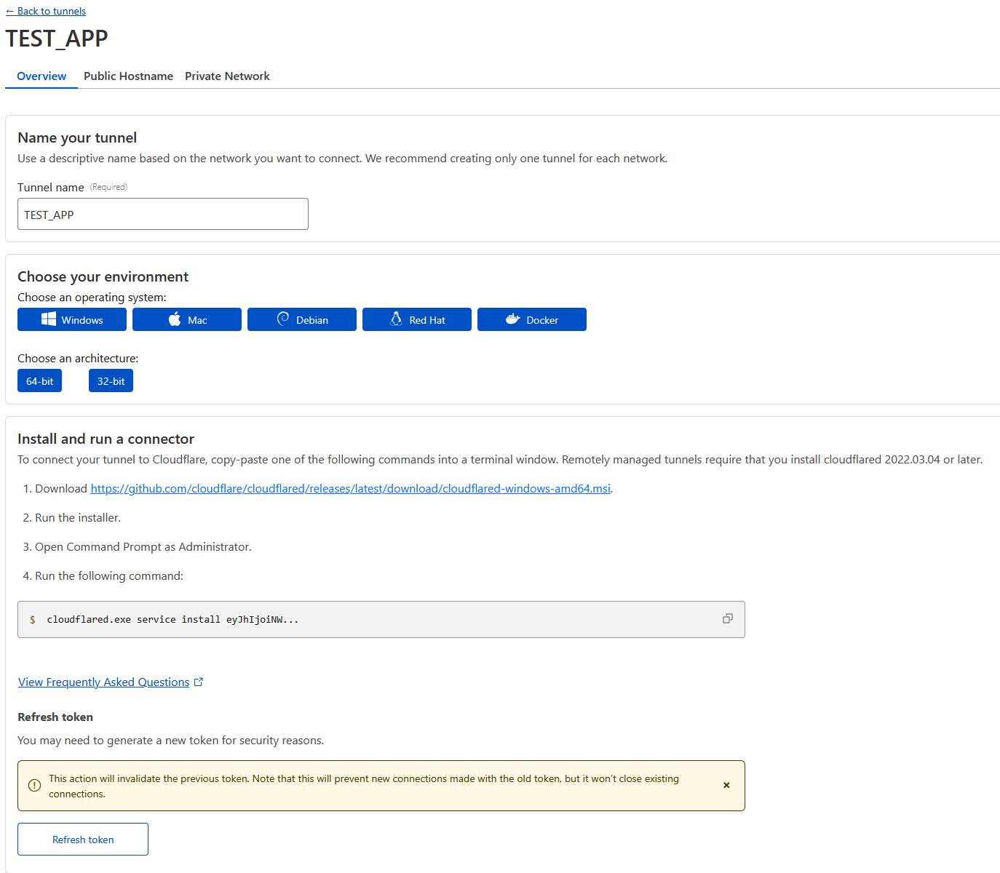
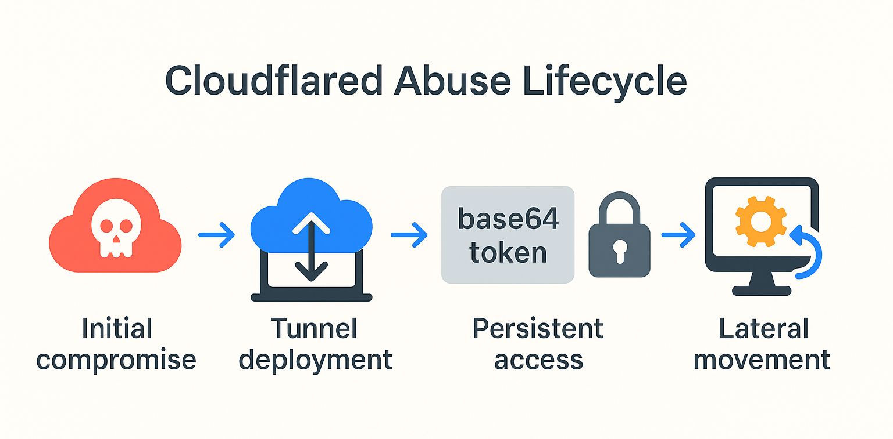
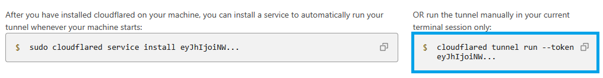
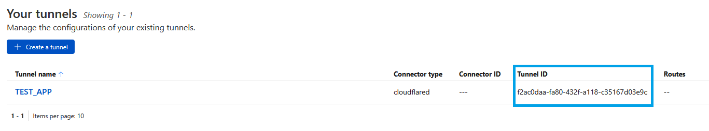

## What is Cloudflared?

To understand Cloudflared at a broad level, we first must discuss the act of **tunneling**. Tunneling is a technique by which
two (or more) hosts can communicate with each other across the internet, typically over an untrusted network. Tunneling itself is
a process commonly employed by Virtual Private Networks (VPNs).

This is accomplished by encapsulating data in additional protocols which only the tunnel may understand
or maintain the ability to decrypt. As such, tunneling offers a secure way to create a trusted network
between remote endpoints.

Tunneling can also be useful for deploying testing and production web applications without the
risk of external exposure; the application can be forwarded through a tunnel to external servers/services,
where the external servers act as proxies, accepting and forwarding traffic to the web application.

Cloudflared is one such application. Cloudflared, formerly known as "Argo", has seen wide success
in its use, finding deployment in numerous production systems as a way for system administrators to
utilize its features to remotely access hosts, deploy web applications, and interact with administrator
tools without exposing them to the broad internet.



## Adversarial Activity

Adversaries and ransomware affiliates have long employed trusted tunneling, VPN, and remote access software to
obtain and maintain access in compromised environments. Cloudflared presents yet another alarming trend in the use
of trusted networking software abused for this purpose.

Bushido's [Ransomware Tool Matrix](https://github.com/BushidoUK/Ransomware-Tool-Matrix) maintains a list
of adversary tooling used by various Ransomware groups and affiliates. This list indicates that BlackSuit,
Royal, Akira, Scattered Spider, and Medusa all employ Cloudflared tunnels as a form of persistent access
and compromise.

Additionally, previous investigations suggest Hunters International has employed said Cloudflared tunnels, though
the indicators of compromise and broader intelligence regarding this group are limited.

Adversaries will gain initial access to an environment through varied means-- VPN compromise, RDP, etc., and lace
the environment or key infrastructure with malicious Cloudflared instances.



With these Cloudflared tunnels in place, the adversary is given essentially local network access, and can employ
the machine(s) as a beachhead to move laterally throughout the network.

## Tokens Decoded

Cloudflared tunnels require connection parameters. These connection parameters can be provided via configuration file,
or more commonly via a command line argument. This command line argument appears as `tunnel run --token <cloudflared_tunnel>`.



Cloudflared tunnel tokens are Base64 encoded JSON data containing:

```json
{
    "a":"account_id",
    "t":"tunnel_id",
    "s":"secret"
}
```

The `account_id` parameter is unique to the account that generates the Cloudflared token-- specifically the
Cloudflared account being used.

The `tunnel_id` parameter is used to identify the unique tunnel being generated. This should be unique on a
per-tunnel basis.



The `secret` parameter is just that; the secret by which the client can safely prove identity with the
Cloudflared infrastructure/tunnel.

Of interest to us is the account_id parameter, the `a` parameter in the Cloudflared token. Adversaries
either have not caught onto this being a trackable parameter, or simply do not care-- as the rate with
which these ransomware groups rotate their account_id is quite low.

This presents a wonderful indicator of compromise itself-- by decoding Cloudflared tokens and
examining them against a corpus of known malicious `account_id`'s, we're able to preemptively detect
the installation of adversarial Cloudflared instances.

## A Network of Indicators

This isn't our only heuristic for detecting Cloudflared abuse though-- and in fact, it makes up a
network of detection characteristics that we can apply to root out these malicious tunnels.

### Malicious Renaming

Cloudflared, by default, installs a service as `cloudflared.exe`. One potential indicator of compromise
may be the renaming of Cloudflared to another potentially benign application.

And, in fact, this holds true-- adversaries tend to stick to similar naming conventions:

#### Medusa

- `svchost.exe`
- `servicehost.exe`

#### BlackSuit

- `WGUpdater.exe`
- `LogMeInUpdater.exe`
- `AdobeUpdater.exe`
- `MozillaUpdater.exe`
- `IntuitUpdater.exe`

By detecting instances of these renamed Cloudflared tokens, we're immediately armed with actionable indicators
of compromise. We can then decode the Base64 encoded Cloudflared token, and begin a hunt against telemetry
for additional Cloudflared tokens with this `account_id`.

### Shared Account IDs

In addition, we may also examine installation anomalies. Cloudflared characteristics are unique on a per-
account basis. This means that the `account_id` should never be shared across two disparate organizations
unless they stem from the same individual. This may make sense-- if I generate 10 Cloudflared tunnel tokens,
they should all indicate that they were created from my account.

While many Managed Service Providers (MSPs) will generate Cloudflared tokens from the same account, it is quite unusual for MSPs to
interact with systems unrelated to their organization. For instance, while three organizations under an MSP may maintain the same
account ID, it would be unusual for this account to create a tunnel *for a different MSP*. And this is the crux of our next
detection characteristic: Cloudflared `account_id`'s should only span a single MSP.

To summarize how we may form detections and investigations around this telemetry:

- Examine and extract indicators of compromise from previous intrusions.
  - Analyze historical data for Cloudflared installations and build a corpus of "known-bad" Cloudflared account IDs.

- Identify instances where Cloudflared has been renamed.
  - Back-propagate malicious instances into existing telemetry to surface additional compromise.

- Identify instances where Cloudflared tokens are shared across disparate systems.
  - Surface and analyze these instances for malicious/unanticipated access.

## Query for Compromise

Using ES|QL, we can generate a query that attempts to decode and 'solve' this problem for us. First, let's generate a query
which gives us these fields in a usable manner. We're going to several columns containing the token, and the `a` `t` and `s`
parameters to facilitate querying.

### Extracting Token Components

```sql
from logs
| WHERE process.command_line LIKE "*tunnel run*" AND process.command_line LIKE "*--token*" -- Identify command line arguments that may indicate Cloudflared usage. We avoid using the executable name here, as it can be renamed.
| DISSECT process.command_line "%{cfPath} --token %{cf.token.array}" -- Destructure our command line argument to extract our token parameter.
| EVAL FROM_BASE64(cf.token.array) -- Convert this string from Base64 into JSON.
| RENAME `FROM_BASE64(cf.token.array)` AS cf.token.array -- Helper function to increase clarity, rename our column.
| DISSECT cf.token.array "{\"a\":\"%{cf.token.a}\",\"t\":\"%{cf.token.t}\",\"s\":\"%{cf.token.s}\"}" -- Use DISECT to parse the JSON and produce our columns.
| keep @timestamp, host.name, account.name, cf.token.a, cf.token.t, cf.token.s -- Keep fields of interest.
```

This ES|QL query should introduce four new columns to our dataset.
These fields will be `cf.token.array` and the `cf.token.a` `t` and `s` values.

### Detecting Shared Account IDs

Now, we can simply utilize these fields to search known indicators of compromise. For instance, if we know that Akira uses a
given account ID, we simply need search for that ID in `cf.token.a`. However, we lose the nuance of surfacing new compromise
or unknown tunnels. That is where we can introduce aggregation and grouping to help ease this lift.

Now, ES|QL is a bit limited in its ability to aggregate information, so we'll need to take a fairly convoluted approach to solving this.

```sql
FROM logs
| WHERE process.command_line LIKE "*tunnel run*" AND process.command_line LIKE "*--token*" 
| DISSECT process.command_line "%{cfPath} --token %{cf.token.array}" 
| WHERE cf.token.array IS NOT NULL AND LENGTH(cf.token.array) == 184 -- Ensure no nulls are included and the payload is as expected-- which is a 184 character long string. 
| EVAL FROM_BASE64(cf.token.array) 
| RENAME `FROM_BASE64(cf.token.array)` AS cf.token.array 
| DISSECT cf.token.array "{\"a\":\"%{cf.token.a}\",\"t\":\"%{cf.token.t}\",\"s\":\"%{cf.token.s}\"}" 
| WHERE cf.token.a IS NOT NULL AND cf.token.t IS NOT NULL AND cf.token.s IS NOT NULL -- Once again, ensure no nulls are being passed down for aggregation.
| KEEP @timestamp, host.name, account.name, cf.token.a, cf.token.t, cf.token.s 
| STATS unique_accounts = count_distinct(account.name) by cf.token.a -- Count the number of distinct account names associated with a given Cloudflared account.
| WHERE unique_accounts > 1 -- Surface any instances where a Cloudflared account ID is used across more than one organization.
| SORT unique_accounts DESC -- Sort this numerically descending. With a large enough corpus of data, adversaries whom have abused the same Cloudflared account will install it on multiple different environments.
```

This should return a table of instances where `cf.token.a` (the Cloudflare `account_id`) is associated with
more than one account name-- which in this case is MSP accounts. Feel free to tweak parameters to fit your environment.

### Investigating Anomalous Account IDs

We can then take these "anomalous Cloudflared `account_id`'s" and apply them back to our initial search.

```sql
from logs
| WHERE process.command_line LIKE "*tunnel run*" AND process.command_line LIKE "*--token*"
| DISSECT process.command_line "%{cfPath} --token %{cf.token.array}" 
| EVAL FROM_BASE64(cf.token.array)
| RENAME `FROM_BASE64(cf.token.array)` AS cf.token.array 
| DISSECT cf.token.array "{\"a\":\"%{cf.token.a}\",\"t\":\"%{cf.token.t}\",\"s\":\"%{cf.token.s}\"}"
| WHERE cf.token.a == "<ANOMALOUS ACCOUNT ID>"
| KEEP @timestamp, host.name, account.name, cf.token.a, cf.token.t, cf.token.s
```

This will yield more granular telemetry, and fields can be kept at-whim to fulfill investigative need.

## Analysis Pitfalls

### SaaS Cloudflared Instances

Of note, operating on a corpus of >3M hosts, some interesting patterns emerge that do not, themselves, indicate compromise
despite satisfying the criteria we've designated above. For instance, in performing analysis of these Cloudflared tunnels,
we can note that a pharmaceutical software vendor distributes a Cloudflared tunnel as part of their software offerings. Security
concerns aside, the inclusion of this Cloudflared `account_id` itself is not particularly anomalous so long as it remains in the
context of pharmaceutical-oriented organizations.

### Benign Renaming

Further to this, renamed Cloudflared tunnels may be deliberate inclusions by the organization, or may be done on behalf of
the installation process. For instance, `cloudflared-windows-amd64.exe` may appear and does not itself represent an anomaly
unless accompanied by above indicators.

Additionally, installers with the `.rbf` extension, a rollback file created by the Windows Installer, may execute and contain
additional indicators of Cloudflared execution. These should be examined on their merits as standard `cloudflared.exe` installers.

### Configuration Files

Configuration files themselves may be passed to Cloudflared as well, and without arbitrary read access to these configuration files,
we cannot delineate the Cloudflared infrastructure/account associated with said tunnel. This may present a small hurdle to investigations
that do not possess the ability to gather these files. However, once malice has been delineated in association with a configuration file,
the information contained within can then be utilized to conduct further hunting.

### Organization Acquisition

Lastly, of note in the analysis, should be the ability for one MSP to contract and install telemetry within an organization, and
subsequently to have a separate MSP acquire said organization. Often, Cloudflared tunnels may stay in place long after the
transition between service providers, which may yield some anomalous behavior.

Best security practice is to remove these instances, but they will show as anomalies within your telemetry if you abide structuring
queries and investigations by MSP account as well. In my day job, this often manifests as an organization switching from its MSP
into an incident response firm which also utilizes our EDR. As such, this host will appear under 'two accounts' for the Cloudflared
`account_id`, but this itself is benign. (Albeit, the Cloudflared instance itself may be malicious.)

## Summary

Cloudflared, while a legitimate tool for secure tunneling and remote access, has been widely co-opted by ransomware affiliates to
maintain persistence within compromised environments. Groups such as BlackSuit, Akira, Royal, Scattered Spider, Medusa, and others
have used Cloudflared tunnels to obfuscate access and evade traditional detection mechanisms.

By decoding Cloudflared tokens—which are Base64-encoded JSON strings containing an account_id, tunnel_id, and secret--
defenders can extract valuable indicators of compromise. In particular, the account_id field offers a consistent fingerprint across
installations and is rarely rotated by adversaries for detection and correlation.

Detection strategies discussed in this article include:

- Identifying renamed instances of Cloudflared (e.g., svchost.exe, LogMeInUpdater.exe),

- Decoding and tracking shared or reused account_ids across disparate organizations,

- Leveraging ES|QL queries to surface anomalous token usage and uncover hidden persistence mechanisms.

While these techniques are powerful, care must be taken to account for edge cases—such as legitimate MSP behavior, software vendors
bundling Cloudflared, or organizational transitions—that may mimic malicious patterns. When applied carefully and at scale, these
methods can significantly enhance threat hunting efforts and uncover adversarial Cloudflared tunnels before they’re operationalized further.
