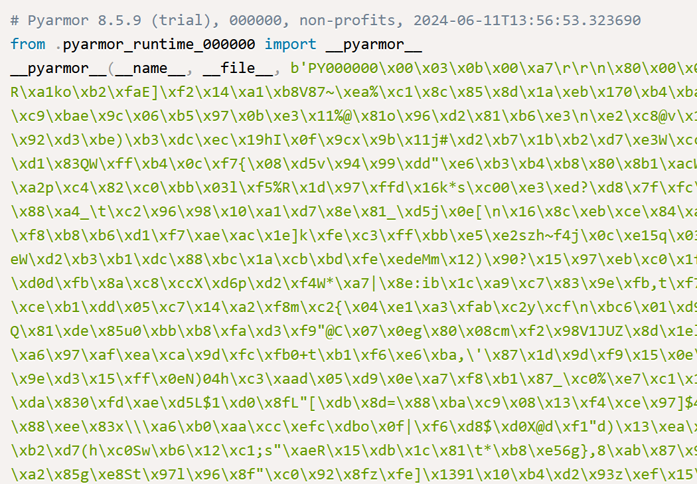
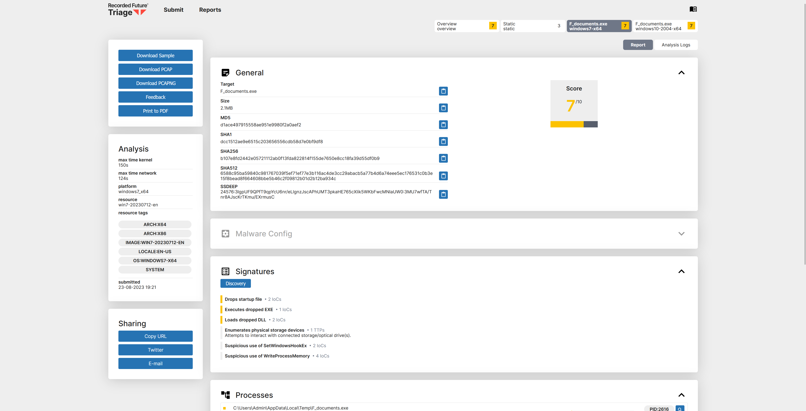

Obfuscation presents a highly reccuring topic of discussion in many development communities.
And it makes sense, people want to protect their intellectual property; the implication
that you may work on some codebase for months or even years to ultimately lose credit for that
work is a frustrating idea conceptually.

However, it creates some interesting security implications on the broader open-source ecosystem.
Obviously, and principally, it's no longer open-source. Quite problematically, while this is
often add odds with the very idea of open-source, many open-source ecosystems will proliferate
these codebases regardless of intent-- and it's shockingly difficult to mandate that code remain
in cleartext within a given software package repository.

## Arbitrating Open-Source

Some of the beauty, I think, in open-source software is that it's typically 'unmoderated'. There's
obviously some guiding principles, but the implication is that it is not governed by some broader
entity that makdes decisions on how code can and cannot be used-- thus empowering developers to
maintain and make those decisions. Imagine for a moment the idea that some guiding body elects to
state that VPN's that evade restrictive geofencing of websites are no longer ethical because they
violate local laws. This is obviously highly prboblematic, and I think this is why OSS/FOSS gains
so much traction-- it's generally unregulated.

However, and I'm wont to draw a parallel to the 'Paradox of Tolerance' here, this has some
self defeating implications in itself.

> [i]f tolerance is taken to the point where it tolerates the destruction of those same principles
> that made tolerance possible in the first place, it becomes intolerable.
>
> - Gaetano Mosca

What does this actually mean though? It's quite simple-- if you tolerate the violation of these
norms within the communities in question, the very foundation of these communities is eroded.
This is a rather verbose introduction to a general frustration I've had when working in open
source security for some time now. Which is the peculiar annoyance I feel when working through
heavily or proprietarily obfuscated packages.

I contend that it is not a violation of developer ecosystem norms to prohibit the exchange
of protected source code, and in fact, I would encourage that more people embrace this prohibitive
modality.

## Security Implications

### From the Defender's Perspective

Chiefly, one of the most tedious concepts around open-source software is actually the security
aspect. But what does this actually mean? Most organizations perform static code scanning.
The internals of this are largely individualistic to different organizations, but I do not think anyone
is truly doing anyting incredibly unique-- there is a list of 'rules' that a code is evaluated against,
and if there is a match, some action or determination is made.

This is actually called **Static Analysis**, and it's relatively important that we make the delineation here.
To allow a bit of wandering for a moment, static analysis tends to be a cheap and effective way to detect
known patterns that may indicate something is malicious. For instance, we may create a rule that detects
the use of `requests.get()` to retrieve some sort of malicious executable. This is simple, it's easy, and
it's very well understood.

Conversely, **Dynamic Analysis** is the art of simply running something and evaluating how it behaves
when it is actually executed. Dynamic analysis, as a concept, is likely the most sustainable and correct
way to secure an ecosystem. The ability to arbitrarily evaluate some codebase, and view how it performs
on a live system is going to offer the most conclusive evidence of malice in a given application.

This isn't without consequences, however. Static analysis tools have existed for decades now. They're
well understood, they're highly optimized, and they're alarmingly performant at scale. In fact, if you're
running any sort of anti-malware service at the moment, there is a 100% chance that you have, within that
codebase, some level of static code analysis, whether it be [YARA](https://github.com/VirusTotal/yara) or
some proprietary language; or some level of simple 'malicious' hash lookup.

Dynamic analysis tools, on the other hand, are continually evolving. We've had Cuckoo Sandbox since the
times of Python 2. And we've seen numerous dynamic analysis sandboxes spawned off of this foundational
concept, such as Recorded Future's [Tria.ge](https://tria.ge) However, the hinge pin here is that it
requires some level of virtualized and secure system, and this almost always drives a huge level of
investment by organizations intending to operate these systems; on top of shockingly few Cloud Service Providers
that are even willing to *host* these environments.

So we've created an immediate power imbalance-- if I want to perform static analysis, I need to view the
code as it exists to the interpreter. Obfuscation strongly defeats this idea. And likewise, if I want to
perform dynamic analysis at any impactful scale, the cost investment increases exponentially.

### From the Developer's Perspective

The repercussions of this are not felt exclusively by security professionals. If you're relying on
a faceless entity to perform security for your production codebase, I'd... generally caution against that
idea for what I believe to be fairly obvious reasons. However, aside from the obvious issues with this
model, as a *developer*, you cannot possibly audit this code either; especially without the tooling that
I discussed previously.

If you're performing due-dilligence in evaluating the dependencies of your dependencies, then this might be as
simple as selecting another library. However, if obfuscated code proliferates, you may find that something
has crept into your codebase through the supply chain itself. And this, inherently, presents a strongly
unique problem to open-source software.


Are your code security tools scanning for obfuscated code in your dependencies?


Simply detecting obfuscation can, itself, be difficult. Often times, some of the best obfuscation occurs
in a manner where you are simply unaware it is obfuscated in the first place. And I don't mean as a viewer,
but from the perspective of a code analysis tool. We may use something like Shanon Entropy to detect
obfuscation, for instance. The English Language behaves a predictable way, and significant deviations from
this pattern may indicate that something is not 'true English'. But quite problematically, applications
can exist in a variety of languages, and chiefly, code *is not plain English*.

Now, I'm under no illusion that most of us couldn't spot something that 'smells' like obfuscated code. It
doesn't look as it purports to be, it doesn't do as it purports to do, or it just doesn't make sense. However,
detecting this is a shockingly difficult problem, and truly advanced threat actors, who present the most imminent
and significant threat to these ecosystems are acutely aware of how these detectors work and how to defeat them.

So it's not only difficult to detect these obfuscated software additions, but there actually exists a far more
concerning problem for developers when it comes to obfuscation. And this takes the form of ignorance.

#### Obfuscation is not Code Security

Say it with me. Obfuscation is not code security. It is absolutely upsetting the amount of open-source software
my organization reverses that results in some sort of developer secret/key leaking when it is fully reversed. Whether
it be in compiled programs, obfuscated programs, compiled and obfuscated programs, etc. I want to make it abundantly
clear-- while deobfuscating these may be a chore, it is by no means impossible, and offers very little in the way of
protection of developer secrets.

Why does this matter though? Well, I think the softest targets in the developer ecosystems are simply the developers
themselves. Advanced Persistent Threats (APTs) *want* to target you, the developer. [Diamond Sleet](https://en.wikipedia.org/wiki/Lazarus_Group)
has long been observed targeting developers in the open-source ecosystem; and obtaining pre-aged, previously human
owned accounts to publish further malicious software both erodes the ability for security researchers to detect
this behavior, and further increases the likelihood of further compromises. This is a critical issue-- and creates
a vicious cycle where we cannot afford to lose control of how this software proliferates within the ecosystem, lest
it become easier itself to proliferate.

### It's Out There Today

Batloader, the initial access malware commonly utilized by threat actors seeking to deploy malware like Qakbot,
which has strong correlations to ransomware deployment in enterprise enviromnents, has already been
[observed utilizing PyArmor](https://www.trendmicro.com/en_us/research/23/h/batloader-campaigns-use-pyarmor-pro-for-evasion.html)
combined with anti-analysis, anti-sandbox features to prevent any truly productionized analysis of these scripts.

Likewise, through exposure to threats at large through my day job, I have noticed an uptick in
[CARBON SPIDER](https://www.crowdstrike.com/blog/carbon-spider-embraces-big-game-hunting-part-1/) campaigns utilizing
a simple online Python obfuscator to rapidly generate obfuscated payloads for their variant of Batloader, as documented
by both [Red Canary](https://redcanary.com/blog/threat-intelligence/msix-installers/) and
[eSentire](https://www.esentire.com/blog/fin7-uses-trusted-brands-and-sponsored-google-ads-to-distribute-msix-payloads).

We've even observed obfuscators themselves distributing malware by placing malicious payloads during the obfuscation
of the code itself, such as in this example:

**Free Coding Tools Distributes Malware - John Hammond**


And the ability to delineate these packages from the slew of other obfuscated packages; which, without intensive analysis,
could proliferate like a wildfire through packaging ecosystems, is a genuine problem.

## Fixing the Bugs

How in the world can we fix this issue? I propose that the buck stops at open-source ecosystem administrators and
packaging ecosystem administrators at large. While I volunteer a good portion of my time securing these ecosystems,
I often feel as though the uphill battle we're placed in is often self defeating in the pursuit of a noble cause.

It is imperative that ecosystem administrators prohibit the proliferation of deliberately obfuscated code, to reduce
the security threat to developers and to enable security researchers to perform due diligence outside of investing
sums of money into researching and deobfuscating malicious packages.

It would be extraordinarily easy for policies to be created to prohibit the publishing of intentionally or deliberately
obfuscated code on these platforms, and enable more rapid action for security researchers to identify and detect
obfuscation at large, instead of focusing on performing extensive and expensive heuristic analysis or investing great
deals of time in static deobfuscation tooling for these environments.

Do I believe that threat actors will follow these rules? Absolutely not-- in fact, I'm counting on it. The idea being
that if something is blatantly against the rules of the platform, it can be immediately removed. While the punitive
actions associated with this may vary based on optional analysis afterward, it immediately addresses an imminent
security threat; and creates a far safer operating environment for developers.

If we are able to remove obfuscated code from open-source ecosystems entirely, we can focus on simply detecting obfuscation
to begin with; instead of trying to ingest and dynamically analyze or statically unpack a given obfuscation schema.
These actions create an environment where the safety of these packaging ecosystems is increasingly assured, that
the opportunities to evade detection and remain present on the platform are decreased, and gives researchers an out
in removing potentially malicious packages that present, in their very essence, a security risk-- all without
mandating any investment in time from any parties involved.
